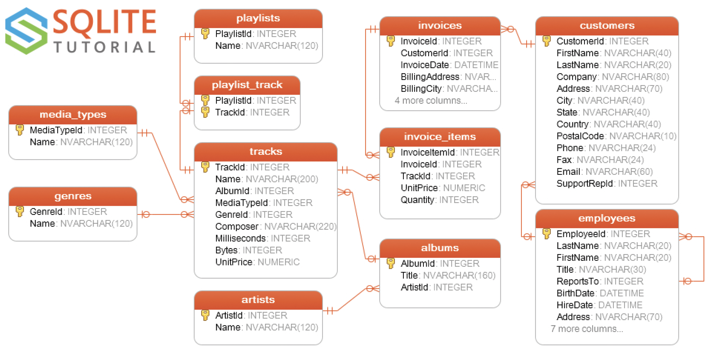

# Practicum SQL - SQLite

## Datamodel Chinook



## Setup

<ol>

<li>

**Install [SQLite Browser](https://sqlitebrowser.org/dl/)** 

</li>

<li>

**Open Database chinook.db**

</li>

<li>

**Select tab <i>Database Structure</i>**

</li>

<li>

**Execute SQL**
```sql
select * 
from Artist 
limit 10;
```

</li>

</ol>

## Practice queries

<ol>

<li>

**Provide a query showing Customers**
```sql
select customer_id, first_name, last_name, country
from customer
```
</li>

<li>

**Provide a query only showing the Customers from Brazil**
```sql
select * 
from customer
where country = 'Brazil'
```

</li>

<li>

**Provide a query showing the Invoices of customers who are from Brazil**

The resultant table should show the customer's full name, Invoice ID, Date of the invoice and billing country.

```sql
select c.first_name, c.last_name, i.invoice_id, i.invoice_date, i.billing_country
from customer as c, invoice as i
where c.country = 'Brazil' and
c.customer_id = i.customer_id
```

</li>

<li>

**Provide a query showing only the Employees who are Sales Agents**
```sql
select * 
from employee
where employee.title = 'Sales Support Agent';
```
</li>

<li>

**Provide a query showing the invoices of customers who are from Brazil**
```sql
select *
from customer as c, invoice as i
where c.country = 'Brazil' and
c.customer_id = i.customer_id;
```
</li>

<li>

**Provide a query that shows the # of customers assigned to each sales agent**
```sql
select e.*, count(c.customer_id) as 'TotalCustomers'
from employee as e
join customer as c on e.employee_id = c.supportrep_id
group by e.employee_id
```

</li>
	
</ol>	
